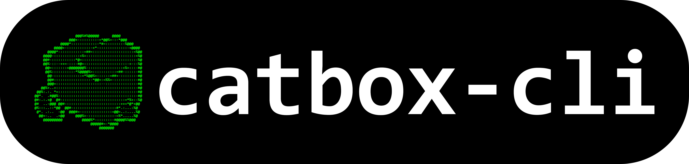

<p align="center">
  
</p>

# catbox-cli 

a simple CLI tool to upload files to [catbox.moe](https://catbox.moe) or [litterbox.catbox.moe](https://litterbox.catbox.moe)

## features ✅

- upload files up to 200MB to Catbox (permanent)
- upload files up to 1GB to Litterbox (temporary, with configurable expiry)
- supports Catbox userhash for uploads to your account
- allows anonymous uploads to Catbox
- progress indicator during upload

## installation 📥

simply install the package with npm!
```sh
npm install catbox-cli
```

## usage 💻

```sh
catbox ./path/to/file [OPTION]
```

### options ⚙️

- `--help`  
  show usage information

- `--anon`  
  upload anonymously (no userhash)

- `--userhash <hash>`  
  use a specific Catbox userhash for uploads (prompts to save as default if not set). if used without a file, saves the userhash as default

- `--time <time>`  
  upload to Litterbox (temporary), valid times: `1h`, `12h`, `24h`, `72h`

### examples 🔽

**upload a file permanently to Catbox:**
```sh
catbox ./myfile.png
```

**upload a file permanently to Catbox anonymously:**
```sh
catbox ./myfile.png --anon
```

**upload a file to Catbox with your userhash:**
```sh
catbox ./myfile.png --userhash YOUR_USERHASH
```

**upload a file temporarily to Litterbox for a day:**
```sh
catbox ./myfile.png --time 24h
```

## notes 📝

- catbox uploads are limited to 200MB per file
- litterbox uploads are limited to 1GB per file and are deleted after the specified time
- you can set a default userhash by uploading with `--userhash` once
- if no userhash is provided, uploads are anonymous

### credits ❤️

catbox API by [catbox.moe](https://catbox.moe/), you can support them [here!](https://catbox.moe/support.php) 🐾

### license 📜

[GNU AGPL v3](LICENSE)